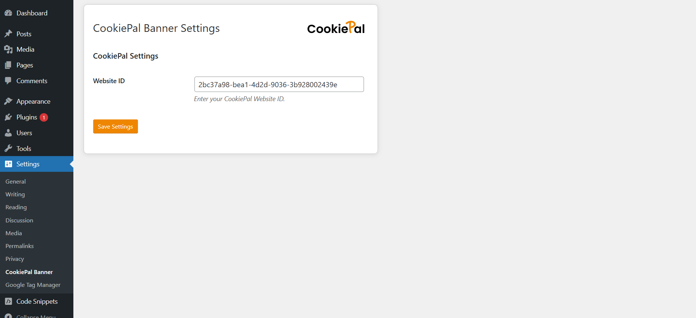

# CookiePal Banner

A lightweight WordPress plugin that injects the CookiePal consent banner script into your site’s header. It lets you configure your CookiePal Website ID right from the WP admin settings.


## Features

- ✅ Adds the CookiePal banner script to the front end  
- ✅ Admin option page to set your **Website ID**  
- ✅ Sanitizes and validates input  
- ✅ Enqueues a custom admin stylesheet for a polished settings UI  
- ⚙️ Integrates with the [WP Consent API](https://wordpress.org/plugins/wp-consent-api/)


## Requirements

- WordPress 5.0 or higher  
- PHP 7.2 or higher  
- [WP Consent API](https://wordpress.org/plugins/wp-consent-api/) plugin  


## Installation

1. Upload the `cookiepal-banner` folder to your WordPress `wp-content/plugins/` directory.  
2. Activate **CookiePal Banner** from the **Plugins** screen in your WordPress admin.  
3. Make sure the **WP Consent API** plugin is installed and activated.


## Configuration

1. In your WordPress admin sidebar, go to **Settings → CookiePal Banner**.  
2. Enter your **CookiePal Website ID** in the input field.  
3. Click **Save Settings**.  

   <details>
   <summary>Screenshot of settings page</summary>

   
   <!-- Replace with your actual screenshot URL -->
   </details>

## How It Works

1. **Front-end Script Injection**  
   When you set a valid Website ID, the plugin enqueues:
   ```html
   <script src="https://dev-cdn.cookiepal.io/client_data/YOUR_WEBSITE_ID/script.js?source=wordpress"></script>
   ```
   just before the closing `</head>` tag.

2. **Consent Bridge**
   The plugin also includes a local file [assets/script.js](./assets/script.js) which contains the `initWordPressConsentBridge()` function. This script is loaded automatically (via the CDN script’s callback) to:

   * Listen for `cookiepal_consent_update` and `cookiepal_banner_load` events
   * Map CookiePal categories (`analytics`, `advertisement`, `functional`) to WP Consent API categories (`statistics`, `marketing`, `preferences`)
   * Define the consent type once (`optin`) and push allow/deny updates to:

     ```js
     window.wp_set_consent(apiCategory, allowed ? 'allow' : 'deny');
     ```
   * Sync any already-stored consent state on page load.

3. **Automatic Sync on Load**
   On `window.load` (or immediately if the page is already loaded), `initWordPressConsentBridge()` runs and ensures your WordPress site’s consent records match what the user selected in CookiePal.


## Demo Video

A walkthrough video of the plugin functionality: [CookiePal Banner Demo](https://www.youtube.com/watch?v=5SrqRVlG1W4) 
